# 🔐 Sistema di Ruoli Clerk - Riepilogo Implementazione

## ✅ Implementazioni Completate

### 1. **Webhook Clerk per Nuovi Utenti**

Il webhook in `src/app/api/webhooks/route.ts` è stato configurato per:

- ✅ Creare automaticamente nuovi utenti con ruolo `USER`
- ✅ Impostare `privateMetadata.role = "USER"` in Clerk
- ✅ Sincronizzare il ruolo tra database e Clerk
- ✅ Gestire separatamente eventi `user.created` e `user.updated`

### 2. **Funzioni Utility Clerk**

Create in `src/lib/clerk-utils.ts`:

- `setUserRole(userId, role)` - Imposta il ruolo in Clerk metadata
- `getUserRole(userId)` - Ottiene il ruolo corrente da Clerk
- `initializeNewUserRole(userId)` - Inizializza nuovi utenti con ruolo USER

### 3. **Aggiornamento Automatico Ruolo SELLER**

Modificato `src/queries/store.ts` per:

- ✅ Aggiornare il ruolo a `SELLER` quando uno store viene approvato
- ✅ Sincronizzare il ruolo sia nel database che in Clerk metadata

### 4. **Strumenti di Test**

Creati per facilitare il testing:

- `src/lib/test-clerk-role.ts` - Script di test completo
- `src/app/api/test-role/route.ts` - Endpoint API per testing (dev only)

### 5. **Documentazione**

- `CLERK_WEBHOOK_SETUP.md` - Guida completa alla configurazione webhook
- Questo file - Riepilogo implementazione

---

## 🚀 Come Usare il Sistema

### Per Nuovi Utenti (Automatico)

Quando un utente si registra:

1. Clerk invia un evento `user.created` al webhook
2. Il webhook crea l'utente nel database con `role: "USER"`
3. Il webhook imposta `privateMetadata.role = "USER"` in Clerk
4. L'utente può ora accedere con permessi base

### Per Promuovere un Utente a SELLER

Quando un admin approva un seller request:

```typescript
// In src/queries/store.ts - updateStoreStatus()
// Questo avviene automaticamente quando status cambia da PENDING ad ACTIVE

// 1. Database aggiornato
await db.user.update({
  where: { id: userId },
  data: { role: "SELLER" },
});

// 2. Clerk metadata aggiornato
await setUserRole(userId, "SELLER");
```

### Per Verificare il Ruolo di un Utente

```typescript
import { getUserRole } from '@/lib/clerk-utils';

const role = await getUserRole(userId);
console.log(role); // "USER" | "SELLER" | "ADMIN" | null
```

---

## 🧪 Testing

### Test Manuale via API (Solo Development)

**Ottieni ruolo corrente:**
```bash
curl http://localhost:3000/api/test-role \
  -H "Cookie: __session=<your-clerk-session>"
```

**Imposta ruolo (esempio):**
```bash
curl -X POST http://localhost:3000/api/test-role \
  -H "Content-Type: application/json" \
  -H "Cookie: __session=<your-clerk-session>" \
  -d '{"role": "SELLER"}'
```

### Test Completo via Script

```typescript
import { testUserRoleSystem } from '@/lib/test-clerk-role';

// Esegui test completo
await testUserRoleSystem('user_xxxxxxxxxxxxx');
```

### Test di Registrazione Nuovo Utente

1. Vai su `/sign-up`
2. Registra un nuovo utente
3. Verifica nei log del server:
   ```
   New user created with role USER: user_xxxxxxxxxxxxx
   ```
4. Controlla nel database:
   ```sql
   SELECT id, email, role FROM users WHERE email = 'new-user@example.com';
   ```
5. Verifica su Clerk Dashboard → Users → [Utente] → Metadata:
   ```json
   {
     "privateMetadata": {
       "role": "USER"
     }
   }
   ```

---

## 📋 Checklist Pre-Produzione

Prima di andare in produzione, assicurati di:

- [ ] Webhook configurato su Clerk Dashboard
- [ ] URL webhook punta al dominio di produzione
- [ ] `CLERK_WEBHOOK_SIGNING_SECRET` configurato correttamente
- [ ] Testato il flusso completo di registrazione
- [ ] Testato l'approvazione seller e cambio ruolo
- [ ] **RIMUOVERE** l'endpoint `/api/test-role` (o proteggerlo)
- [ ] Verificare che tutti i nuovi utenti abbiano ruolo USER
- [ ] Verificare che i seller approvati abbiano ruolo SELLER

---

## 🔄 Flusso Completo

### Flusso Registrazione Utente

```mermaid
graph TD
    A[Utente si registra] --> B[Clerk crea account]
    B --> C[Clerk invia webhook user.created]
    C --> D[Webhook crea utente in DB con role=USER]
    D --> E[Webhook imposta privateMetadata.role=USER]
    E --> F[Utente può accedere come USER]
```



### Flusso Approvazione Seller


---

## 🐛 Troubleshooting Comuni

### "L'utente non ha il ruolo USER dopo la registrazione"

**Possibili cause:**
1. Webhook non configurato correttamente
2. `CLERK_WEBHOOK_SIGNING_SECRET` mancante o errato
3. Webhook URL non raggiungibile

**Soluzione:**
1. Verifica su Clerk Dashboard → Webhooks → Delivery Logs
2. Controlla i log del server per errori
3. Usa ngrok per il testing locale

### "Il ruolo non viene aggiornato quando divento seller"

**Possibili cause:**
1. La funzione `setUserRole` non viene chiamata
2. Errore durante l'aggiornamento dei metadata

**Soluzione:**
1. Verifica i log del server quando lo store viene approvato
2. Controlla che `CLERK_SECRET_KEY` sia configurato
3. Verifica manualmente con l'endpoint `/api/test-role`

### "Errore: Invalid webhook signature"

**Causa:**
Il `CLERK_WEBHOOK_SIGNING_SECRET` non corrisponde

**Soluzione:**
1. Vai su Clerk Dashboard → Webhooks → Il tuo endpoint
2. Copia il Signing Secret
3. Aggiorna il valore in `.env`
4. Riavvia il server

---

## 🔒 Sicurezza

### Best Practices Implementate

✅ Webhook verificato con firma Svix
✅ Ruolo USER come default per tutti i nuovi utenti
✅ Sincronizzazione bidirezionale tra DB e Clerk
✅ Validazione dei ruoli prima dell'assegnazione
✅ Log dettagliati per audit

### Attenzione

⚠️ L'endpoint `/api/test-role` è disabilitato in produzione
⚠️ Solo gli admin possono modificare i ruoli tramite dashboard
⚠️ Il webhook secret deve rimanere privato

---

## 📞 Supporto

In caso di problemi:

1. Controlla i log del server
2. Verifica la configurazione del webhook su Clerk
3. Consulta la documentazione ufficiale: [Clerk Webhooks](https://clerk.com/docs/integrations/webhooks)
4. Usa gli strumenti di test forniti

---

## ✨ Funzionalità Future (Opzionali)

- [ ] Dashboard admin per gestione ruoli
- [ ] Log audit per cambio ruoli
- [ ] Notifiche email quando il ruolo cambia
- [ ] Supporto per ruoli personalizzati
- [ ] Migrazione batch per utenti esistenti

---

**Ultimo aggiornamento:** 2025-01-23
**Versione:** 1.0.0
